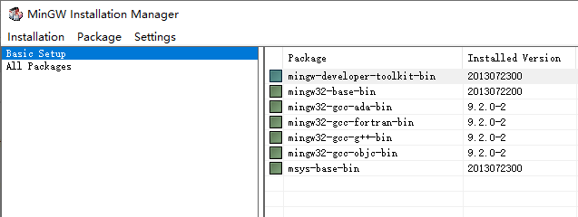
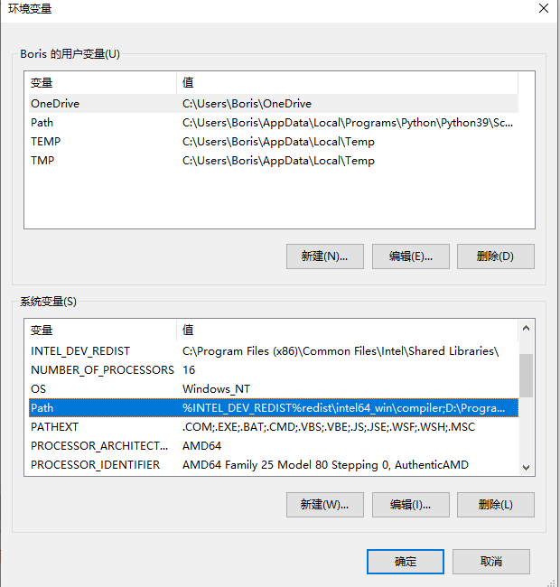
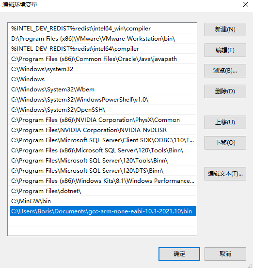
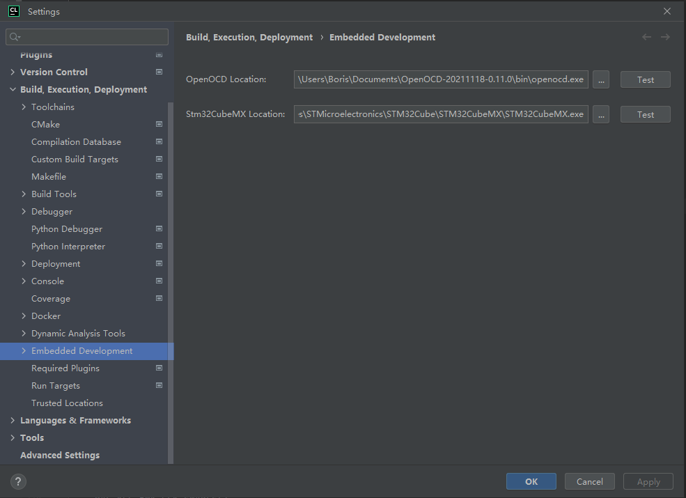

# 前言

***作者水平有限，内容可能存在不正确的地方，欢迎批评指正。**

最近做新项目又要用回STM32，不太想继续用Keil来进行开发了。作为一个Jetbrains全家桶用了小几年的用户来说，肯定有什么办法能继续用这一类IDE来对STM32进行继续开发！

你说巧不巧，看见了[稚晖君的这篇文章](https://zhuanlan.zhihu.com/p/145801160)，里面介绍了如何用Clion对STM32进行优♂雅的开发，但无奈这篇文章发布于2020年，新版软件的设置与其文章有些不同，在简单踩坑之后（其实并没有什么坑，Clion对STM32CUBEMX的支持已经比较完备），成功点了个灯，在这里写下这篇文章，以备后需。

# 参考文章

[配置CLion用于STM32开发【优雅の嵌入式开发】|知乎](https://zhuanlan.zhihu.com/p/145801160)

[STM32CubeMX projects | CLion](https://www.jetbrains.com/help/clion/embedded-development.html)

# 环境配置

在这里需要提前下载安装好几个软件，可以直接参考稚晖君的文章进行安装。在这里我针对Nucleo开发板也简单讲解下：

### 软件环境

- Windows 10

- Clion 2022.2.1

- STM32CubeMX 6.6.1

- gcc-arm-none-eabi-10.3-2021.10

- OpenOCD-20211118-0.11.0

- MinGW

### 硬件环境

- STM32 Nucleo F401RE

### Clion安装

[CLion: A Cross-Platform IDE for C and C++ by JetBrains](https://www.jetbrains.com/clion/)

官网直接下载安装即可

### STM32CubeMX安装

[STM32Cube initialization code generator](https://www.st.com/en/development-tools/stm32cubemx.html#st-get-software)

直接选择STM32CubeMX-Win的最新版本安装即可

### gcc-arm-none-eabi安装

[Downloads | GNU Arm Embedded Toolchain Downloads – Arm Developer](https://developer.arm.com/downloads/-/gnu-rm)

下拉选择压缩包([**gcc-arm-none-eabi-10.3-2021.10-win32.zip**](https://developer.arm.com/-/media/Files/downloads/gnu-rm/10.3-2021.10/gcc-arm-none-eabi-10.3-2021.10-win32.zip?rev=8f4a92e2ec2040f89912f372a55d8cf3&hash=8A9EAF77EF1957B779C59EADDBF2DAC118170BBF))形式，下载完成后将压缩包内的文件解压至自己的目录，后续需要使用

### OpenOCD安装

[Download OpenOCD for Windows](https://gnutoolchains.com/arm-eabi/openocd/)

下载完成后，同样将压缩包内的文件解压至自己的目录，后续需要使用

### MinGW安装

[Download File List - MinGW - Minimalist GNU for Windows - OSDN](https://osdn.net/projects/mingw/releases/)

首先下载安装器，mingw-get-setup.exe，安装完成后启动。

启动后，点击右侧的Basic Setup，对右边的所有Package进行右键，Mark for installation。

全选后，点击Installation > Apply Changes 进行安装。

# 环境变量设置

在这里需要设置gcc编译器和arm-gcc交叉编译工具链的可执行文件所在目录添加到windows的path环境变量。

进入windows系统属性，或直接在搜索栏搜索“环境变量”。

打开后，点击下方的“环境变量”。

在下方的系统变量中，找到path，并双击进入。

将mingw的bin目录，gcc-arm-none-eabi的bin目录添加进系统的path环境变量。

完成修改后重启电脑，启动windows的命令行，输入`gcc -v`，如正确提示则表示gcc的环境变量成功配置。

# Clion配置

启动Clion，开始配置。

点击File > Settings进入Clion设置页面。

### Embedded Development设置

OpenOCD Location，指向OpenOCD的bin/openocd.exe

Stm32CubeMX Location，指向STM32CubeMX的STM32CubeMX.exe

选择正确后，点击Test将提示为绿色。

### Tool Chians配置

 
